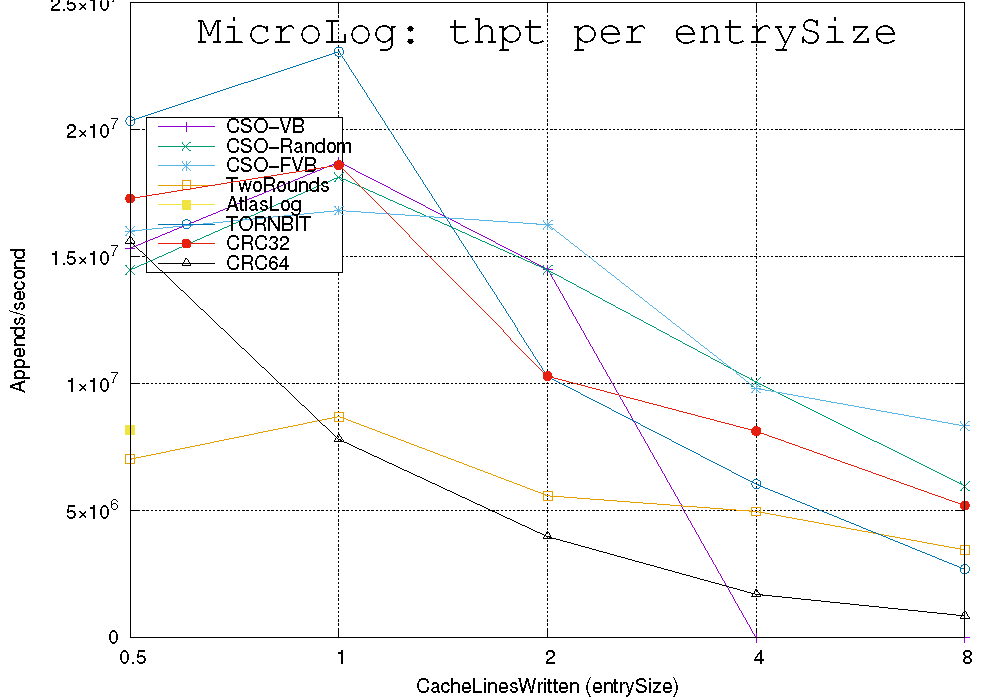
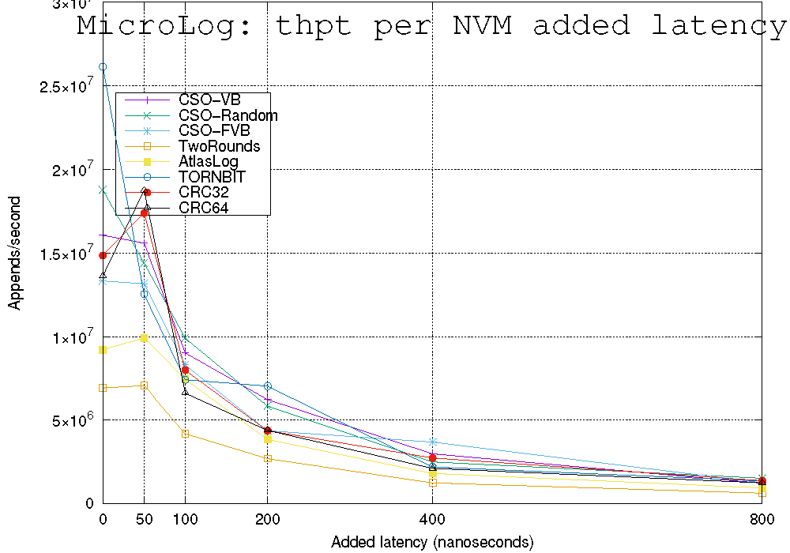
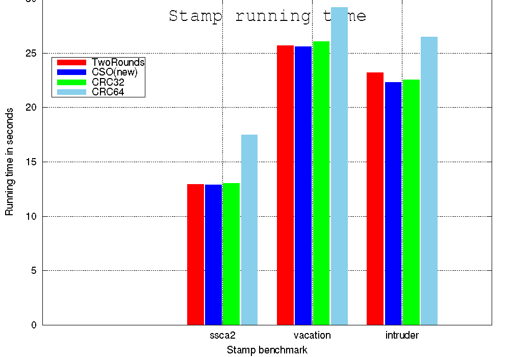
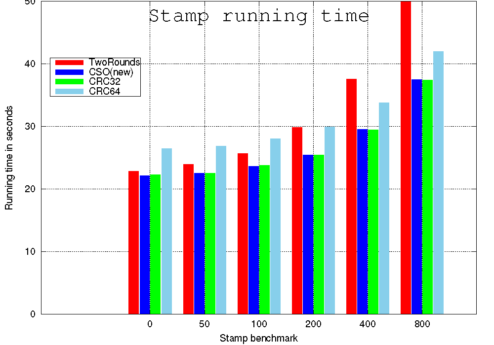
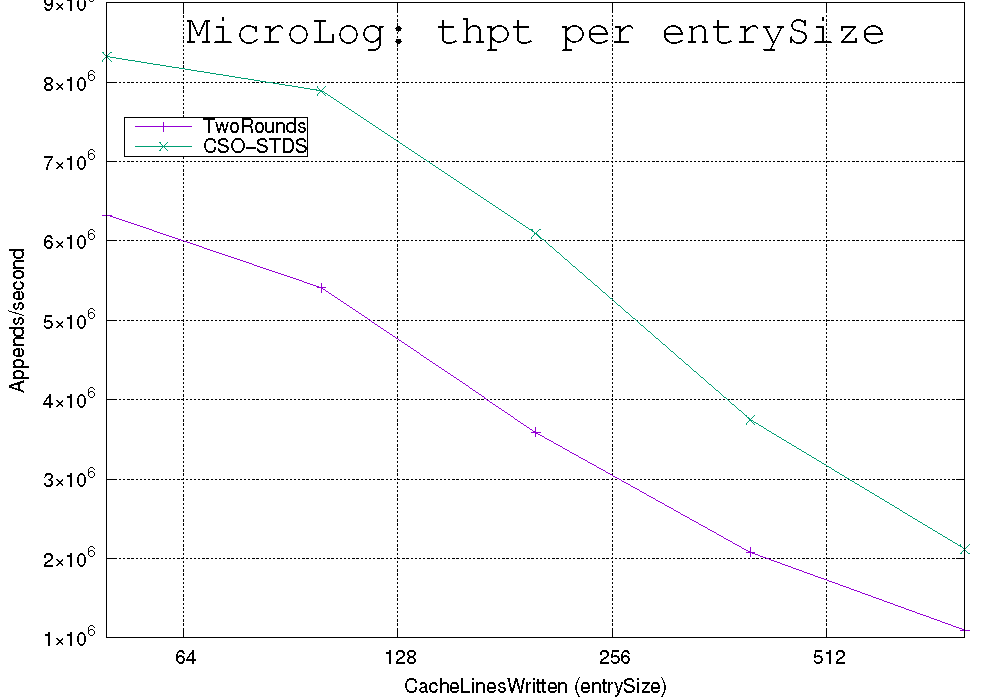
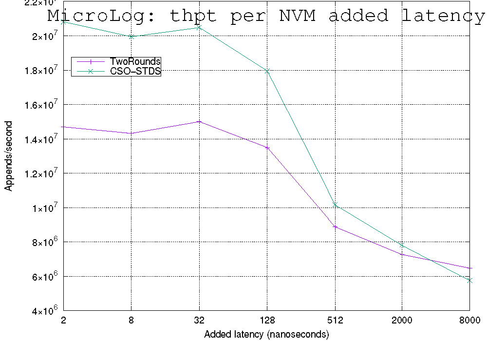
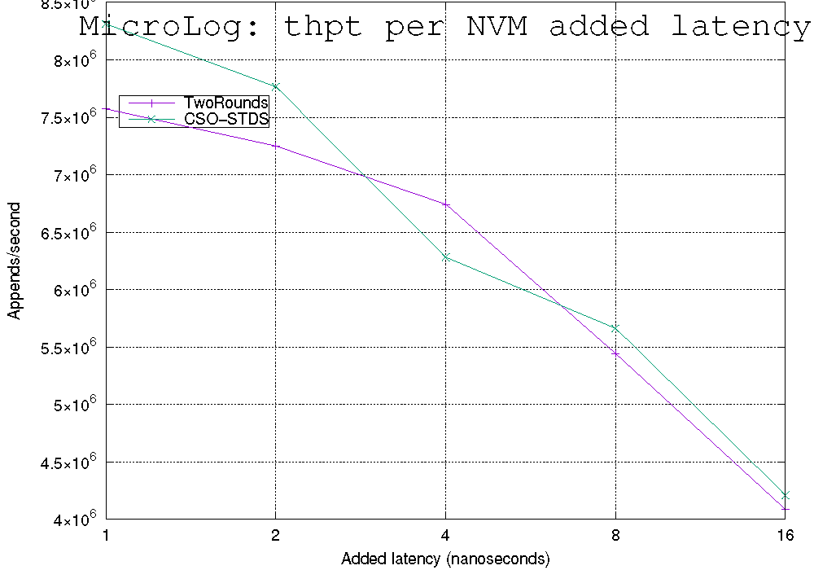

# Lab Report on Research Artifact

* Date of examination: 26.11.2021
* Start time: 15:30
* End time: 17:30
* * * 
* Date of examination: 27.11.2021
* Start time: 15:15
* End time: 15:45
* * * 
* Date of examination: 29.11.2021
* Start time: 13:00
* End time: 14:00
* * * 
* Date of examination: 01.12.2021
* Start time: 14:00
* End time: 15:00
* * * 
* Date of examination: 05.12.2021
* Start time: 14:00
* End time: 16:00

## Metadata

* Paper DOI (necessary): 10.1145/3133891
* Artifact DOI (optional):
* Badges achieved in regular artifact evaluation: Artifacts Available, Artifacts Evaluated–Functional  
* Time (in minutes) needed to read the paper: 50 min

## Availability

* [ ] Artifact is archived in a public archive with a long-term retention policy (which one(s)?)
* [ ] Artifact is available on a different website (which one(s)?)
* [x] Artifact is available in the version that was submitted to artifact evaluation
* [x] Artifact is available in the version that passed artifact evaluation
* [ ] Artifact is available in a public version control system
* [ ] Artifact is available in a self-contained form (container, VM)
* Time (in minutes) needed for the check: 2 min

### Checks performed

<!-- Note all checks you performed here to answer the above questions. The following are just examples! You can skip any of them or add any additional ones that make sense for the links we provided you. -->
1. Artifact is directly accessible from provided link

### Observations

<!-- Note all observations (negative, neutral, or positive) made -->
* The Artifact can be downloaded directly through the link called _Auxiliary Archive_, which was attended as _Supplemental Material_ in the DOI of the paper.


## Artifact Type

<!-- Please indicate the artifact type. Multiple selection possible. -->

* [x] Code
* [ ] Dataset
* [ ] Automated proof
* [ ] Manual proof
* [ ] Other (please specify)
* Time (in minutes) needed for the check: 20 min

### Checks performed

<!-- Note all checks you performed here to answer the above questions -->
The artifact includes the source code of four experiments mentioned in the paper. They named as four folders, **Atlas, LogMircro, STDS, TinySTM**. In each folder, a bash script file of _FigureX.sh_ (X corresponds to the number of the chart corresponding to each experiment) is used as the interface to process the experiment.
### Observations
#### Positive
* All the specific implementation details of the experiment are encapsulated in a bash script. The final results can also be displayed intuitively.
#### Negative
* There is no instruction file like README to explain the specific usage of the artifact. When I first checked it, it took about 20 minutes to confirm the usage of the artifact.

## Functional

<!-- Venues before 2017 did not have the ACM badges. Therefore, the calls for artifacts usually do not contain explicit criteria for functional/reusable. In this case, please use the definitions and criteria from the ACM artifact evaluation/badging website. -->

* [ ] Artifact is considered functional
* [ ] Artifact is NOT considered functional
* [x] Artifact is considered partially functional 

* Time (in minutes) needed for the check: 30 min (Observations-1/2) + 60 min (Observations-3) + 60 min (Observations-4)

### Checks performed

<!-- Note all checks you performed here to answer the above questions -->
* [ ] Documented -- Only two of the four experiments (TinySTM, Atlas) contain instructions for dependent libraries, and only one experiment (TinySTM) contains instructions for experimental procedures.
* [x] Consistent-- Artifacts are related to the experiments and serve as the main supporting tool for the conclusion of the paper.
* [ ] Complete:-- Although some custom libraries are integrated in the artifact, there is a lack of instructions and access to the dependent libraries required to run the artifact.
* [x] Exercisable-- After the experiment is successfully run, the visualization graphics in the paper can be generated, and all the data in the experiment process are retained.

### Observations
<!-- Note all observations (negative, neutral, or positive) made -->
#### Positive
* The results of the experiments are output directly as graphical files with an _.eps_ suffix, and the data from each iteration of the experiment is saved as a data file with a _.dat_ suffix, and the specific data is also saved as a text file in a folder named _output_

#### Negative
* For the four experiments, there is the lack of global documentation to point out the operating environment and dependent libraries required for implementation. Among the folders corresponding to the four experiments, only _TinySTM_ and _Atlas_ contain the dependent libraries required for the experiment and instructions for the experiment steps.

### Observations-1 (27.11.2021)
<!-- Note all observations (negative, neutral, or positive) made -->
* Try to compile and run the experiment contained in the **LogMicro** folder.
* Due to the lack of instructions for the dependent libraries and steps in this folder, it took a long time to infer the running mode of the experiment based on the source code and script files. It is finally confirmed that the script file named _FigureX.sh_ is the running interface of the experiment, which includes the call and compilation of the source code, and the visualization of the final output data.
* Since there is no documentation about the dependent libraries required for the experiment, I finally installed the necessary dependent libraries for the experiment based on the errors thrown during the operation and self-research.
* The results of this experiment saved as EPS files and DAT files.
### Observations-2 (27.11.2021)
* Try to compile and run the experiment contained in the **TinySTM** folder.
* According to the instructions of the README file in the **tinySTM** subfolder, after confirming that the necessary libraries are installed, the experiment proceeded successfully.
* Encountered a strange problem. There is an optional test folder in the **tinySTM** subfolder. The compilation of this folder is used to confirm the integrity of the compilation process. According to the README file, the test folder should all be compiled Passed, but two errors were thrown in the actual process. Since the result did not actually affect the normal operation of the experiment, it is currently unclear whether it will affect the experimental result.

### Observations-3 (29.11.2021)
* Try to compile and run the experiment contained in the **Atlas** folder.
* Before running for the first time, according to the instructions of the README file, all the required dependent libraries are installed, and the default C++ compiler is changed to clang. It must be explained that the llvm/clang version used is _3.6.0_, and the version used in this experiment is _13.0.1_.
* The error was thrown in the build phase of the _compiler-plugin_. It shows ``` Build shared lib failed on compilation, check build_log.txt ```
  <details>
    <summary>build_log.txt</summary>

    ```
    Compiling object files
  src/Instrumentation/NvmInstrumenter.cpp:61:21: error: virtual function 'getPassName' has a different return type ('const char *') than the function it overrides (which has return type 'llvm::StringRef')
          const char *getPassName() const { return "nvm_instr"; }
                ~~~~~~^
  /usr/lib/llvm-10/include/llvm/Pass.h:94:21: note: overridden virtual function is here
    virtual StringRef getPassName() const;
            ~~~~~~~~~ ^
  src/Instrumentation/NvmInstrumenter.cpp:230:24: error: no matching function for call to 'dyn_cast'
      AcquireFuncEntry = dyn_cast<Function>(
                        ^~~~~~~~~~~~~~~~~~
  /usr/lib/llvm-10/include/llvm/Support/Casting.h:337:59: note: candidate function [with X = llvm::Function, Y = llvm::FunctionCallee] not viable: expects an l-value for 1st argument
  LLVM_NODISCARD inline typename cast_retty<X, Y>::ret_type dyn_cast(Y &Val) {
                                                            ^
  /usr/lib/llvm-10/include/llvm/Support/Casting.h:332:5: note: candidate template ignored: requirement '!is_simple_type<llvm::FunctionCallee>::value' was not satisfied [with X = llvm::Function, Y = llvm::FunctionCallee]
      dyn_cast(const Y &Val) {
      ^
  /usr/lib/llvm-10/include/llvm/Support/Casting.h:342:61: note: candidate template ignored: could not match 'Y *' against 'llvm::FunctionCallee'
  LLVM_NODISCARD inline typename cast_retty<X, Y *>::ret_type dyn_cast(Y *Val) {
                                                              ^
  src/Instrumentation/NvmInstrumenter.cpp:241:24: error: no matching function for call to 'dyn_cast'
      ReleaseFuncEntry = dyn_cast<Function>(
                        ^~~~~~~~~~~~~~~~~~
  /usr/lib/llvm-10/include/llvm/Support/Casting.h:337:59: note: candidate function [with X = llvm::Function, Y = llvm::FunctionCallee] not viable: expects an l-value for 1st argument
  LLVM_NODISCARD inline typename cast_retty<X, Y>::ret_type dyn_cast(Y &Val) {
                                                            ^
  /usr/lib/llvm-10/include/llvm/Support/Casting.h:332:5: note: candidate template ignored: requirement '!is_simple_type<llvm::FunctionCallee>::value' was not satisfied [with X = llvm::Function, Y = llvm::FunctionCallee]
      dyn_cast(const Y &Val) {
      ^
  /usr/lib/llvm-10/include/llvm/Support/Casting.h:342:61: note: candidate template ignored: could not match 'Y *' against 'llvm::FunctionCallee'
  LLVM_NODISCARD inline typename cast_retty<X, Y *>::ret_type dyn_cast(Y *Val) {
                                                              ^
  src/Instrumentation/NvmInstrumenter.cpp:251:22: error: no matching function for call to 'dyn_cast'
      StoreFuncEntry = dyn_cast<Function>(
                      ^~~~~~~~~~~~~~~~~~
  /usr/lib/llvm-10/include/llvm/Support/Casting.h:337:59: note: candidate function [with X = llvm::Function, Y = llvm::FunctionCallee] not viable: expects an l-value for 1st argument
  LLVM_NODISCARD inline typename cast_retty<X, Y>::ret_type dyn_cast(Y &Val) {
                                                            ^
  /usr/lib/llvm-10/include/llvm/Support/Casting.h:332:5: note: candidate template ignored: requirement '!is_simple_type<llvm::FunctionCallee>::value' was not satisfied [with X = llvm::Function, Y = llvm::FunctionCallee]
      dyn_cast(const Y &Val) {
      ^
  /usr/lib/llvm-10/include/llvm/Support/Casting.h:342:61: note: candidate template ignored: could not match 'Y *' against 'llvm::FunctionCallee'
  LLVM_NODISCARD inline typename cast_retty<X, Y *>::ret_type dyn_cast(Y *Val) {
                                                              ^
  src/Instrumentation/NvmInstrumenter.cpp:263:23: error: no matching function for call to 'dyn_cast'
      MemCpyFuncEntry = dyn_cast<Function>(
                        ^~~~~~~~~~~~~~~~~~
  /usr/lib/llvm-10/include/llvm/Support/Casting.h:337:59: note: candidate function [with X = llvm::Function, Y = llvm::FunctionCallee] not viable: expects an l-value for 1st argument
  LLVM_NODISCARD inline typename cast_retty<X, Y>::ret_type dyn_cast(Y &Val) {
                                                            ^
  /usr/lib/llvm-10/include/llvm/Support/Casting.h:332:5: note: candidate template ignored: requirement '!is_simple_type<llvm::FunctionCallee>::value' was not satisfied [with X = llvm::Function, Y = llvm::FunctionCallee]
      dyn_cast(const Y &Val) {
      ^
  /usr/lib/llvm-10/include/llvm/Support/Casting.h:342:61: note: candidate template ignored: could not match 'Y *' against 'llvm::FunctionCallee'
  LLVM_NODISCARD inline typename cast_retty<X, Y *>::ret_type dyn_cast(Y *Val) {
                                                              ^
  src/Instrumentation/NvmInstrumenter.cpp:275:24: error: no matching function for call to 'dyn_cast'
      MemMoveFuncEntry = dyn_cast<Function>(
                        ^~~~~~~~~~~~~~~~~~
  /usr/lib/llvm-10/include/llvm/Support/Casting.h:337:59: note: candidate function [with X = llvm::Function, Y = llvm::FunctionCallee] not viable: expects an l-value for 1st argument
  LLVM_NODISCARD inline typename cast_retty<X, Y>::ret_type dyn_cast(Y &Val) {
                                                            ^
  /usr/lib/llvm-10/include/llvm/Support/Casting.h:332:5: note: candidate template ignored: requirement '!is_simple_type<llvm::FunctionCallee>::value' was not satisfied [with X = llvm::Function, Y = llvm::FunctionCallee]
      dyn_cast(const Y &Val) {
      ^
  /usr/lib/llvm-10/include/llvm/Support/Casting.h:342:61: note: candidate template ignored: could not match 'Y *' against 'llvm::FunctionCallee'
  LLVM_NODISCARD inline typename cast_retty<X, Y *>::ret_type dyn_cast(Y *Val) {
                                                              ^
  src/Instrumentation/NvmInstrumenter.cpp:287:23: error: no matching function for call to 'dyn_cast'
      MemSetFuncEntry = dyn_cast<Function>(
                        ^~~~~~~~~~~~~~~~~~
  /usr/lib/llvm-10/include/llvm/Support/Casting.h:337:59: note: candidate function [with X = llvm::Function, Y = llvm::FunctionCallee] not viable: expects an l-value for 1st argument
  LLVM_NODISCARD inline typename cast_retty<X, Y>::ret_type dyn_cast(Y &Val) {
                                                            ^
  /usr/lib/llvm-10/include/llvm/Support/Casting.h:332:5: note: candidate template ignored: requirement '!is_simple_type<llvm::FunctionCallee>::value' was not satisfied [with X = llvm::Function, Y = llvm::FunctionCallee]
      dyn_cast(const Y &Val) {
      ^
  /usr/lib/llvm-10/include/llvm/Support/Casting.h:342:61: note: candidate template ignored: could not match 'Y *' against 'llvm::FunctionCallee'
  LLVM_NODISCARD inline typename cast_retty<X, Y *>::ret_type dyn_cast(Y *Val) {
                                                              ^
  src/Instrumentation/NvmInstrumenter.cpp:299:23: error: no matching function for call to 'dyn_cast'
      StrCpyFuncEntry = dyn_cast<Function>(
                        ^~~~~~~~~~~~~~~~~~
  /usr/lib/llvm-10/include/llvm/Support/Casting.h:337:59: note: candidate function [with X = llvm::Function, Y = llvm::FunctionCallee] not viable: expects an l-value for 1st argument
  LLVM_NODISCARD inline typename cast_retty<X, Y>::ret_type dyn_cast(Y &Val) {
                                                            ^
  /usr/lib/llvm-10/include/llvm/Support/Casting.h:332:5: note: candidate template ignored: requirement '!is_simple_type<llvm::FunctionCallee>::value' was not satisfied [with X = llvm::Function, Y = llvm::FunctionCallee]
      dyn_cast(const Y &Val) {
      ^
  /usr/lib/llvm-10/include/llvm/Support/Casting.h:342:61: note: candidate template ignored: could not match 'Y *' against 'llvm::FunctionCallee'
  LLVM_NODISCARD inline typename cast_retty<X, Y *>::ret_type dyn_cast(Y *Val) {
                                                              ^
  src/Instrumentation/NvmInstrumenter.cpp:311:23: error: no matching function for call to 'dyn_cast'
      StrCatFuncEntry = dyn_cast<Function>(
                        ^~~~~~~~~~~~~~~~~~
  /usr/lib/llvm-10/include/llvm/Support/Casting.h:337:59: note: candidate function [with X = llvm::Function, Y = llvm::FunctionCallee] not viable: expects an l-value for 1st argument
  LLVM_NODISCARD inline typename cast_retty<X, Y>::ret_type dyn_cast(Y &Val) {
                                                            ^
  /usr/lib/llvm-10/include/llvm/Support/Casting.h:332:5: note: candidate template ignored: requirement '!is_simple_type<llvm::FunctionCallee>::value' was not satisfied [with X = llvm::Function, Y = llvm::FunctionCallee]
      dyn_cast(const Y &Val) {
      ^
  /usr/lib/llvm-10/include/llvm/Support/Casting.h:342:61: note: candidate template ignored: could not match 'Y *' against 'llvm::FunctionCallee'
  LLVM_NODISCARD inline typename cast_retty<X, Y *>::ret_type dyn_cast(Y *Val) {
                                                              ^
  src/Instrumentation/NvmInstrumenter.cpp:323:23: error: no matching function for call to 'dyn_cast'
      StrLenFuncEntry = dyn_cast<Function>(
                        ^~~~~~~~~~~~~~~~~~
  /usr/lib/llvm-10/include/llvm/Support/Casting.h:337:59: note: candidate function [with X = llvm::Function, Y = llvm::FunctionCallee] not viable: expects an l-value for 1st argument
  LLVM_NODISCARD inline typename cast_retty<X, Y>::ret_type dyn_cast(Y &Val) {
                                                            ^
  /usr/lib/llvm-10/include/llvm/Support/Casting.h:332:5: note: candidate template ignored: requirement '!is_simple_type<llvm::FunctionCallee>::value' was not satisfied [with X = llvm::Function, Y = llvm::FunctionCallee]
      dyn_cast(const Y &Val) {
      ^
  /usr/lib/llvm-10/include/llvm/Support/Casting.h:342:61: note: candidate template ignored: could not match 'Y *' against 'llvm::FunctionCallee'
  LLVM_NODISCARD inline typename cast_retty<X, Y *>::ret_type dyn_cast(Y *Val) {
                                                              ^
  src/Instrumentation/NvmInstrumenter.cpp:334:24: error: no matching function for call to 'dyn_cast'
      BarrierFuncEntry = dyn_cast<Function>(
                        ^~~~~~~~~~~~~~~~~~
  /usr/lib/llvm-10/include/llvm/Support/Casting.h:337:59: note: candidate function [with X = llvm::Function, Y = llvm::FunctionCallee] not viable: expects an l-value for 1st argument
  LLVM_NODISCARD inline typename cast_retty<X, Y>::ret_type dyn_cast(Y &Val) {
                                                            ^
  /usr/lib/llvm-10/include/llvm/Support/Casting.h:332:5: note: candidate template ignored: requirement '!is_simple_type<llvm::FunctionCallee>::value' was not satisfied [with X = llvm::Function, Y = llvm::FunctionCallee]
      dyn_cast(const Y &Val) {
      ^
  /usr/lib/llvm-10/include/llvm/Support/Casting.h:342:61: note: candidate template ignored: could not match 'Y *' against 'llvm::FunctionCallee'
  LLVM_NODISCARD inline typename cast_retty<X, Y *>::ret_type dyn_cast(Y *Val) {
                                                              ^
  src/Instrumentation/NvmInstrumenter.cpp:345:25: error: no matching function for call to 'dyn_cast'
      PsyncAcqFuncEntry = dyn_cast<Function>(
                          ^~~~~~~~~~~~~~~~~~
  /usr/lib/llvm-10/include/llvm/Support/Casting.h:337:59: note: candidate function [with X = llvm::Function, Y = llvm::FunctionCallee] not viable: expects an l-value for 1st argument
  LLVM_NODISCARD inline typename cast_retty<X, Y>::ret_type dyn_cast(Y &Val) {
                                                            ^
  /usr/lib/llvm-10/include/llvm/Support/Casting.h:332:5: note: candidate template ignored: requirement '!is_simple_type<llvm::FunctionCallee>::value' was not satisfied [with X = llvm::Function, Y = llvm::FunctionCallee]
      dyn_cast(const Y &Val) {
      ^
  /usr/lib/llvm-10/include/llvm/Support/Casting.h:342:61: note: candidate template ignored: could not match 'Y *' against 'llvm::FunctionCallee'
  LLVM_NODISCARD inline typename cast_retty<X, Y *>::ret_type dyn_cast(Y *Val) {
                                                              ^
  src/Instrumentation/NvmInstrumenter.cpp:357:27: error: no matching function for call to 'dyn_cast'
      AsyncDataFlushEntry = dyn_cast<Function>(
                            ^~~~~~~~~~~~~~~~~~
  /usr/lib/llvm-10/include/llvm/Support/Casting.h:337:59: note: candidate function [with X = llvm::Function, Y = llvm::FunctionCallee] not viable: expects an l-value for 1st argument
  LLVM_NODISCARD inline typename cast_retty<X, Y>::ret_type dyn_cast(Y &Val) {
                                                            ^
  /usr/lib/llvm-10/include/llvm/Support/Casting.h:332:5: note: candidate template ignored: requirement '!is_simple_type<llvm::FunctionCallee>::value' was not satisfied [with X = llvm::Function, Y = llvm::FunctionCallee]
      dyn_cast(const Y &Val) {
      ^
  /usr/lib/llvm-10/include/llvm/Support/Casting.h:342:61: note: candidate template ignored: could not match 'Y *' against 'llvm::FunctionCallee'
  LLVM_NODISCARD inline typename cast_retty<X, Y *>::ret_type dyn_cast(Y *Val) {
                                                              ^
  src/Instrumentation/NvmInstrumenter.cpp:368:32: error: no matching function for call to 'dyn_cast'
      AsyncMemOpDataFlushEntry = dyn_cast<Function>(
                                ^~~~~~~~~~~~~~~~~~
  /usr/lib/llvm-10/include/llvm/Support/Casting.h:337:59: note: candidate function [with X = llvm::Function, Y = llvm::FunctionCallee] not viable: expects an l-value for 1st argument
  LLVM_NODISCARD inline typename cast_retty<X, Y>::ret_type dyn_cast(Y &Val) {
                                                            ^
  /usr/lib/llvm-10/include/llvm/Support/Casting.h:332:5: note: candidate template ignored: requirement '!is_simple_type<llvm::FunctionCallee>::value' was not satisfied [with X = llvm::Function, Y = llvm::FunctionCallee]
      dyn_cast(const Y &Val) {
      ^
  /usr/lib/llvm-10/include/llvm/Support/Casting.h:342:61: note: candidate template ignored: could not match 'Y *' against 'llvm::FunctionCallee'
  LLVM_NODISCARD inline typename cast_retty<X, Y *>::ret_type dyn_cast(Y *Val) {
                                                              ^
  In file included from src/Instrumentation/NvmInstrumenter.cpp:20:
  In file included from /usr/lib/llvm-10/include/llvm/IR/IRBuilder.h:36:
  /usr/lib/llvm-10/include/llvm/IR/Module.h:360:43: error: no matching constructor for initialization of 'SmallVector<llvm::Type *, sizeof...(ArgsTy)>'
      SmallVector<Type*, sizeof...(ArgsTy)> ArgTys{Args...};
                                            ^     ~~~~~~~~~
  /usr/lib/llvm-10/include/llvm/IR/Module.h:370:12: note: in instantiation of function template specialization 'llvm::Module::getOrInsertFunction<llvm::PointerType *, long>' requested here
      return getOrInsertFunction(Name, AttributeList{}, RetTy, Args...);
            ^
  src/Instrumentation/NvmInstrumenter.cpp:231:11: note: in instantiation of function template specialization 'llvm::Module::getOrInsertFunction<llvm::PointerType *, long>' requested here
          M.getOrInsertFunction("nvm_acquire", IRB.getVoidTy(),
            ^
  /usr/lib/llvm-10/include/llvm/ADT/SmallVector.h:846:12: note: candidate constructor not viable: no known conversion from 'llvm::PointerType *' to 'size_t' (aka 'unsigned long') for 1st argument
    explicit SmallVector(size_t Size, const T &Value = T())
            ^
  /usr/lib/llvm-10/include/llvm/ADT/SmallVector.h:855:3: note: candidate template ignored: deduced conflicting types for parameter 'ItTy' ('llvm::PointerType *' vs. 'long')
    SmallVector(ItTy S, ItTy E) : SmallVectorImpl<T>(N) {
    ^
  /usr/lib/llvm-10/include/llvm/ADT/SmallVector.h:860:12: note: candidate constructor template not viable: requires single argument 'R', but 2 arguments were provided
    explicit SmallVector(const iterator_range<RangeTy> &R)
            ^
  /usr/lib/llvm-10/include/llvm/ADT/SmallVector.h:865:3: note: candidate constructor not viable: requires single argument 'IL', but 2 arguments were provided
    SmallVector(std::initializer_list<T> IL) : SmallVectorImpl<T>(N) {
    ^
  /usr/lib/llvm-10/include/llvm/ADT/SmallVector.h:869:3: note: candidate constructor not viable: requires single argument 'RHS', but 2 arguments were provided
    SmallVector(const SmallVector &RHS) : SmallVectorImpl<T>(N) {
    ^
  /usr/lib/llvm-10/include/llvm/ADT/SmallVector.h:879:3: note: candidate constructor not viable: requires single argument 'RHS', but 2 arguments were provided
    SmallVector(SmallVector &&RHS) : SmallVectorImpl<T>(N) {
    ^
  /usr/lib/llvm-10/include/llvm/ADT/SmallVector.h:884:3: note: candidate constructor not viable: requires single argument 'RHS', but 2 arguments were provided
    SmallVector(SmallVectorImpl<T> &&RHS) : SmallVectorImpl<T>(N) {
    ^
  /usr/lib/llvm-10/include/llvm/ADT/SmallVector.h:839:3: note: candidate constructor not viable: requires 0 arguments, but 2 were provided
    SmallVector() : SmallVectorImpl<T>(N) {}
    ^
  In file included from src/Instrumentation/NvmInstrumenter.cpp:20:
  In file included from /usr/lib/llvm-10/include/llvm/IR/IRBuilder.h:36:
  /usr/lib/llvm-10/include/llvm/IR/Module.h:360:43: error: no matching constructor for initialization of 'SmallVector<llvm::Type *, sizeof...(ArgsTy)>'
      SmallVector<Type*, sizeof...(ArgsTy)> ArgTys{Args...};
                                            ^     ~~~~~~~~~
  /usr/lib/llvm-10/include/llvm/IR/Module.h:370:12: note: in instantiation of function template specialization 'llvm::Module::getOrInsertFunction<llvm::PointerType *, llvm::IntegerType *, long>' requested here
      return getOrInsertFunction(Name, AttributeList{}, RetTy, Args...);
            ^
  src/Instrumentation/NvmInstrumenter.cpp:252:11: note: in instantiation of function template specialization 'llvm::Module::getOrInsertFunction<llvm::PointerType *, llvm::IntegerType *, long>' requested here
          M.getOrInsertFunction("nvm_store",
            ^
  /usr/lib/llvm-10/include/llvm/ADT/SmallVector.h:846:12: note: candidate constructor not viable: requires at most 2 arguments, but 3 were provided
    explicit SmallVector(size_t Size, const T &Value = T())
            ^
  /usr/lib/llvm-10/include/llvm/ADT/SmallVector.h:855:3: note: candidate constructor template not viable: requires 2 arguments, but 3 were provided
    SmallVector(ItTy S, ItTy E) : SmallVectorImpl<T>(N) {
    ^
  /usr/lib/llvm-10/include/llvm/ADT/SmallVector.h:860:12: note: candidate constructor template not viable: requires single argument 'R', but 3 arguments were provided
    explicit SmallVector(const iterator_range<RangeTy> &R)
            ^
  /usr/lib/llvm-10/include/llvm/ADT/SmallVector.h:865:3: note: candidate constructor not viable: requires single argument 'IL', but 3 arguments were provided
    SmallVector(std::initializer_list<T> IL) : SmallVectorImpl<T>(N) {
    ^
  /usr/lib/llvm-10/include/llvm/ADT/SmallVector.h:869:3: note: candidate constructor not viable: requires single argument 'RHS', but 3 arguments were provided
    SmallVector(const SmallVector &RHS) : SmallVectorImpl<T>(N) {
    ^
  /usr/lib/llvm-10/include/llvm/ADT/SmallVector.h:879:3: note: candidate constructor not viable: requires single argument 'RHS', but 3 arguments were provided
    SmallVector(SmallVector &&RHS) : SmallVectorImpl<T>(N) {
    ^
  /usr/lib/llvm-10/include/llvm/ADT/SmallVector.h:884:3: note: candidate constructor not viable: requires single argument 'RHS', but 3 arguments were provided
    SmallVector(SmallVectorImpl<T> &&RHS) : SmallVectorImpl<T>(N) {
    ^
  /usr/lib/llvm-10/include/llvm/ADT/SmallVector.h:839:3: note: candidate constructor not viable: requires 0 arguments, but 3 were provided
    SmallVector() : SmallVectorImpl<T>(N) {}
    ^
  16 errors generated.
    ```

  </details>

* Since it is necessary to compile the compiler-plugin, the experiment was forced to stop when the required files were not created.
* In terms of troubleshooting, according to the content in the build_log file, it is guessed that the cause of the error is that the functions in llvm/clang have been updated due to version reasons, and the experiments based on the 3.6.0 version cannot call these functions correctly.
* Since the Linux distribution used in this experiment is **Ubuntu 20.04.3**, under this version, the earliest clang version that can be supported is 4.0, and the experiment is performed again after trying to use llvm/clang 4.0 as the preferred compiler version. The problem Still not resolved.


### Observations-4 (01.12.2021)
* Try to compile and run the experiments contained in the **STDS** folder.
* The following error is thrown during compilation
  ``` 
  multithread.hpp:43:14: error: ‘pid_t gettid()’ was declared ‘extern’ and later ‘static’ [-fpermissive]
    43 | static pid_t gettid(void){
        |              ^~~~~~
  In file included from /usr/include/unistd.h:1170,
                  from multithread.hpp:13,
                  from main.cpp:10:
  /usr/include/x86_64-linux-gnu/bits/unistd_ext.h:34:16: note: previous declaration of ‘__pid_t gettid()’
    34 | extern __pid_t gettid (void) __THROW;
        |                ^~~~~~
  In file included from multithread.cpp:8:
  multithread.hpp:43:14: error: ‘pid_t gettid()’ was declared ‘extern’ and later ‘static’ [-fpermissive]
    43 | static pid_t gettid(void){
        |              ^~~~~~
  ```

*  According to the self-research, the declaration of the same object in C++, at least after g++ version 5.1, the method of declaring ``extern`` first and then declaring ``static`` will not be accepted by compiler.

### Observations-5 (05.12.2021)
* After consulting with Stefan Winter, I decided to experiment again on the Ubuntu16.04 version that supports clang 3.6.0 and confirm whether it is the problem of the artifact itself.
* Re-built the operating environment based on Ubuntu 16.04 and llvm/clang 3.6, and downloaded the necessary dependent libraries. The plug-in generation issue was resolved, but at the same time a new error was thrown.
* An error is thrown when loading the plugin: 
  ```
  error: unable to load plugin 
       '/home/wenfeng/Downloads/oopsla17-oopsla76-aux/OOPSLA_NVMLOG_AE/Atlas/runtime/../compiler-plugin/plugin_build/NvmInstrumenter.so': 
       '/home/wenfeng/Downloads/oopsla17-oopsla76-aux/OOPSLA_NVMLOG_AE/Atlas/runtime/../compiler-plugin/plugin_build/NvmInstrumenter.so: 
       undefined symbol: _ZNK4llvm12FunctionPass17createPrinterPassERNS_11raw_ostreamERKSs'
  ```
* After trying various possible solutions found on the Internet, for example, whether the dependent libraries are missing, and use the ```ldd``` command to check. The problem still cannot be solved.

### Observation-6 (11.01.2022)
* The experiment of STDS was tried again in a clang 3.6 based dockers container with Stefan's guidance and was successful.
* Try the Atlas experiment in the same docker container. It is worth mentioning about "**To use clang with instrumentation**" setting. Previously, I had set clang 3.6 as the default compiler by downloading it and setting it manually, instead of setting environment variables. The README file states:
  ```
  $ACC: clang -Xclang -load -Xclang <path_to_Atlas>/compiler-plugin/plugin_build/NvmInstrumenter.so
  $ACXX: clang++ -Xclang -load -Xclang <path_to_Atlas>/compiler-plugin/plugin_build /NvmInstrumenter.so
  ```
  Now it is assumed that the experiment uses ACC,ACXX environment variables for clang calls, and setting clang as the default compiler is not feasible.
* After installing the required dependencies for Atlas in the container, the experiment runs smoothly, but fails to produce output data. The build process was successful, but the core part of the experiment was to run the four programs ``alarm_clock_nvm``, ``cow_array_list_nvm``, ``queue_nvm``, ``stores_nvm`` 100 iterations for each.
However, the output of each iteration of each program shows: 
  ```
  expr: syntax error: missing argument after '+'.
  ```

## Reusable

<!-- Venues before 2017 did not have the ACM badges. Therefore, the calls for artifacts usually do not contain explicit criteria for functional/reusable. In this case, please use the definitions and criteria from the ACM artifact evaluation/badging website. -->

* [ ] Artifact is considered reusable
* [ ] Artifact is NOT considered reusable
* [x] Artifact is considered partially reusable
* Time (in minutes) needed for the check: 30 min

### Checks performed

* Read the documentation of the artifact
* Steps to verify its functionality

<!-- Note all checks you performed here to answer the above questions -->

### Observations

<!-- Note all observations (negative, neutral, or positive) made -->
* Four parts of the artifact, two of them have good reusability. The other two of them needs to be run in a specific environment, i.e. clang version 3.6.
* The artifact contains the source code and has a good structure file to illustrate the function and structure of each part of the artifact. It declares its open source nature and can facilitate users to modify the artifacts customized.
* Two of the experiments, ```STDS``` and ```Atlas```, they can all be executed in a clang 3.6 based environment. Among them, ``STDS`` can get the output data and charts. ``Atlas`` can also be executed successfully, i.e. the whole runtime does not throw any execution error, but eventually the data cannot be output and the chart visualization is empty.

## Result reproducibility with the artifact

<!-- Please start with results that the artifact documentation claims to be reproducible. If no such claims can be found, please note this in the observations. After that, please check which results/conclusion are supported by the artifact and which ones are not (irrespective of the results in the paper actually match your observations with the artifact). In the last step, please check which of the supported results/conclusions match. -->

* [ ] Results from the paper are fully supported by the artifact (i.e., it should in theory be possible to reproduce all results from the paper)
* [x] Results from the paper are partially supported by the artifact
* [ ] Results from the paper are not supported by the artifact
* [ ] Results that are supported by the artifact could be fully reproduced
* [x] Results that are supported by the artifact could be partially reproduced
* [ ] Results from the paper could not be reproduced
* Time (in minutes) needed for the check: 20min

### Checks performed

<!-- Note all checks you performed here to answer the above questions -->
* The final result of the operation of the artifact is displayed in the same way as the paper in a visual chart.
* Compare the chart in the paper with the chart obtained after running the artifact to confirm its reproducibility.

### Observations

<!-- Note all observations (negative, neutral, or positive) made -->
<!-- In case of partial result reproduction, please state what did and did not work -->
### LogMicro
<table rules="none" align="center">
	<tr>
		<td>
			<center>
				
				<br/>
				<font color="AAAAAA">Figure4a-Output</font>
			</center>
		</td>
		<td>
			<center>
				
				<br/>
				<font color="AAAAAA">Figure4a-Original</font>
			</center>
		</td>
	</tr>

  <tr>
		<td>
      <center>
			  
				  <br/>
				  <font color="AAAAAA">Figure4b-Output</font>
      </center>
		</td>
		<td>
			<center>
				
				<br/>
				<font color="AAAAAA">Figure4b-Original</font>
			</center>
		</td>
	</tr>
</table>

* The **CSO-VB** algorithm shows the same efficiency decline as described in the paper, and its continuity reaches 4 cache lines (2 in the paper).
* The **TORNBIT** algorithm also shows the same trend as shown in the paper. And it is worth noting that although the TORNBIT algorithm has a very fast declining trends, its performance in half-caches has an overwhelming advantage. It even surpasses the best algorithm CSO-VB claimed in the paper, rather than the fact that it has been inferior to other algorithms as claimed in the paper.
* The rest algorithms, **CSO-RANDOM, CSO-FVB, CRC32, CRC64, Atlas, TwoRounds**. They are all the same as the conclusions claimed in the paper.
* After adding the latency, each algorithm showed the same downward trend as the paper, but it is worth noting that the TORNBIT algorithm and the CSO-Random algorithm show significant advantages. And the Atlas and TwoRounds algorithms are most affected as described in the paper.
* Therefore, although the algorithm designed in the paper has shown better performance in the current actual test, it does not show such a big advantage compared with other algorithms used for comparison in the paper.

### TinySTM
<table rules="none" align="center">
	<tr>
		<td>
			<center>
				
				<br/>
				<font color="AAAAAA">Figure5a-Output</font>
			</center>
		</td>
		<td>
			<center>
				
				<br/>
				<font color="AAAAAA">Figure5a-Original</font>
			</center>
		</td>
	</tr>
</table>
<table>
  <tr>
		<td>
      <center>
			  
				  <br/>
				  <font color="AAAAAA">Figure5b-Output</font>
      </center>
		</td>
		<td>
			<center>
				
				<br/>
				<font color="AAAAAA">Figure4b-Original</font>
			</center>
		</td>
	</tr>
</table>


* For this experiment, it must be stated that the results produced by the artifact are not converted based on the baseline. The results presented in the paper are based on the TwoRounds algorithm, showing the efficiency comparison of CSO, CRC32, and CRC64 algorithms. The artifact directly outputs the running time of the four algorithms.
* After conversion, under the three benchmarks(ssca2, vacation, intruder), the CRC64 algorithm presents the same disadvantages as the paper compared to the TwoRounds algorithm. However, the CSO and CRC32 algorithms presented in the paper have obvious advantages. In actual experiments, the efficiency of the TwoRounds algorithm is basically the same, and even slightly inferior to the TwoRounds algorithm in the intruder.
* After adding the latency to the experiment, the CSO and CRC32 algorithm still does not show the advantages described in the paper in the latency interval of 0-100ms, which is basically equivalent to the efficiency of the TwoRounds algorithm. After the latency was higher than 200, the experiment showed results close to the paper.
### STDS
<table rules="none" align="center">
	<tr>
		<td>
			<center>
				
				<br/>
				<font color="AAAAAA">Figure7a-Output</font>
			</center>
		</td>
		<td>
			<center>
				
				<br/>
				<font color="AAAAAA">Figure7a-Original</font>
			</center>
		</td>
	</tr>
</table>

* Consistent with the results claimed in the paper: **With no additional latency (i.e., the latency of NVM is similar to DRAM), single-trip persistent set provides 25% performance improvement over the baseline.**

<table>
  <tr>
		<td>
      <center>
			  
				  <br/>
				  <font color="AAAAAA">Figure7b-Output</font>
      </center>
		</td>
		<td>
			<center>
				
				<br/>
				<font color="AAAAAA">Figure7b-Original</font>
			</center>
		</td>
	</tr>
</table>

* Consistent with the results claimed in the paper
<table>
  <tr>
		<td>
      <center>
			  
				  <br/>
				  <font color="AAAAAA">Figure7c-Output</font>
      </center>
		</td>
		<td>
			<center>
				
				<br/>
				<font color="AAAAAA">Figure7c-Original</font>
			</center>
		</td>
	</tr>
</table>

* STDS has a performance advantage over TwoRounds in 1 or 2 cache lines, but only by about 10%, and not by more than 25% as claimed in the paper. When the number of cache lines increases, the performance of the two algorithms is almost the same, even around 4 cache lines, where STDS performance is inferior to TwoRounds. As claimed in the paper, although both algorithms suffer from performance degradation as the number of cache lines increases, STDS always has a clear advantage. This is not consistent with the results obtained in this experiment.

### Atlas
* Available in the Functional chapter of Observation-6.
* The running output:
  ```
  Building compiler plugin
  Found clang++ in /usr/local/bin/clang++
  Found llvm-config in /usr/local/bin/llvm-config
  Compiling object files
  Compilation successful
  Linking
  Linking successful
  Successfully built compiler plugin NvmInstrumenter.so
  NvmInstrumenter.so is under plugin_build/
  Building Baseline Atlas
  mkdir: cannot create directory 'build': File exists
  Found a compiler plugin build in /host/oopsla17-oopsla76-aux/OOPSLA_NVMLOG_AE/Atlas/runtime/../compiler-plugin/plugin_build/NvmInstrumenter.so
  Defaulting to build all tests
  -- Configuring done
  -- Generating done
  -- Build files have been written to: /host/oopsla17-oopsla76-aux/OOPSLA_NVMLOG_AE/Atlas/runtime/build
  [  2%] Built target Pregion_mgr
  [  6%] Built target Cache_flush
  [ 13%] Built target Consistency
  [ 23%] Built target Logger
  [ 26%] Built target Util
  [ 29%] Built target Pmalloc
  [ 30%] Built target atlas
  [ 33%] Built target createclosedelete
  [ 36%] Built target createclose
  [ 38%] Built target createclosefocclose
  [ 41%] Built target focclose
  [ 44%] Built target finddelete
  [ 47%] Built target focdelete
  [ 50%] Built target alarm_clock
  [ 52%] Built target stores
  [ 55%] Built target sll
  [ 58%] Built target queue
  [ 61%] Built target queue_nvm
  [ 63%] Built target sll_mt
  [ 66%] Built target alarm_clock_nvm
  [ 69%] Built target cow_array_list
  [ 72%] Built target sll_ll
  [ 75%] Built target stores_nvm
  [ 77%] Built target cow_array_list_nvm
  [ 80%] Built target sll_nvm
  [ 83%] Built target sll_mt_ll
  [ 86%] Built target malloc_free_test
  [ 88%] Built target new_delete
  [ 91%] Built target recover
  [ 94%] Built target del_rgn
  [ 97%] Built target clean_mem
  [100%] Built target del_log
  Building Atlas with New Logging Algorithm
  mkdir: cannot create directory 'build': File exists
  Found a compiler plugin build in /host/oopsla17-oopsla76-aux/OOPSLA_NVMLOG_AE/Atlas/CSOruntime/../compiler-plugin/plugin_build/NvmInstrumenter.so
  Defaulting to build all tests
  -- Configuring done
  -- Generating done
  -- Build files have been written to: /host/oopsla17-oopsla76-aux/OOPSLA_NVMLOG_AE/Atlas/CSOruntime/build
  [  2%] Built target Pregion_mgr
  [  6%] Built target Cache_flush
  [ 13%] Built target Consistency
  [ 22%] Built target Logger
  [ 25%] Built target Util
  [ 28%] Built target Pmalloc
  [ 29%] Built target atlas
  [ 32%] Built target createclosedelete
  [ 35%] Built target createclose
  [ 37%] Built target createclosefocclose
  [ 40%] Built target focclose
  [ 43%] Built target finddelete
  [ 45%] Built target focdelete
  [ 48%] Built target alarm_clock
  [ 51%] Built target queue
  [ 54%] Built target stores
  [ 56%] Built target sll
  [ 59%] Built target memcpy_nvm
  [ 62%] Built target queue_nvm
  [ 64%] Built target sll_mt
  [ 67%] Built target alarm_clock_nvm
  [ 70%] Built target cow_array_list
  [ 72%] Built target sll_ll
  [ 75%] Built target stores_nvm
  [ 78%] Built target cow_array_list_nvm
  [ 81%] Built target sll_nvm
  [ 83%] Built target sll_mt_ll
  [ 86%] Built target malloc_free_test
  [ 89%] Built target new_delete
  [ 91%] Built target recover
  [ 94%] Built target del_rgn
  [ 97%] Built target clean_mem
  [100%] Built target del_log
  Running Atlas benchmarks
  Running program alarm_clock_nvm for 100 iterations
  expr: syntax error: missing argument after '+'
            (100 repetitions)
  (standard_in) 1: syntax error
  Running program cow_array_list_nvm for 100 iterations
  expr: syntax error: missing argument after '+'
            (100 repetitions)
  (standard_in) 1: syntax error
  Running program queue_nvm for 100 iterations
  expr: syntax error: missing argument after '+'
            (100 repetitions)
  (standard_in) 1: syntax error
  Running program stores_nvm for 100 iterations
  expr: syntax error: missing argument after '+'
            (100 repetitions)
  (standard_in) 1: syntax error
  Building the graph
  "plotFiles/Atlas.plt" line 2: warning: iconv failed to convert degree sign
  "plotFiles/Atlas.plt" line 22: warning: Skipping data file with no valid points

  plot "RawAtlas.dat" using 2:xtic(1) title "speedup" linecolor rgb skyblue, 
                                                                            ^
  "plotFiles/Atlas.plt" line 22: x range is invalid

  Finished to parse.
  Please look at Atlas.eps for the graph and RawAtlas.dat for comma separated raw data
  ```


### Conjectures and additions
* Although most of the experiments yielded results similar to those described in the paper, it must be noted that a large portion of the graphs obtained by running the scripts included in the artifacts have inconsistent markings, such as the names of the horizontal and vertical coordinates, and even some of the graphs represent results that require further conversion for visual comparison with the paper's conclusions. Although the essence of the experiment is the data and this part is just a data visualization, it is clear that the artifact is not better illustrated and adapted for the reviewer or the user of the artifact.
* There is a reasonable guess. Since the paper stated that at the time of writing, NVM components were not available on the market, DRAM was used to simulate NVM components for experiments. The equipment used in this experiment has an SSD with the NVM protocol, so the difference in the basic hardware may cause some deviations in the experimental results.


